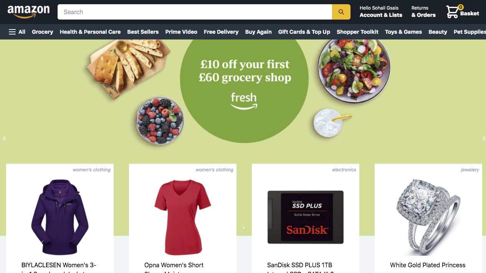

## Amazon

Full stack amazon clone using nextjs for server side rendering of products,orders and basket items,
tailwindcss for responsive design, redux for shopping basket functionality, NextAuth authentication with


## Techs Used :
- Nextjs
    - next-auth
- Redux
- firebase
- Stripe
    - webhooks
- Tailwindcss
- Fake Store API
- Heroicons
## Authors

- [@Sohail Gsais](https://www.github.com/SohailMG)
## Demo

- [Live Site](https://https://amazon-clone-iota-liart.vercel.app/)
## Screenshots



## Related

Here are some related projects

[Awesome README](https://github.com/matiassingers/awesome-readme)
## Lessons Learned
- Server Side Rendering with nextjs
- State Management with Redux
- User Authentication with NextAuth
- API(Fake Store API)
- Responsive Design with Tailwindcss
- Using Stripe API for payment transactions
- Creating my first webhook with stripe

## Installation

clone this repo

```bash
  cd amazon-clone && npm install or yarn install
```

## Feedback

If you have any feedback, please reach out to us at gsais.sohail9@gmail.com

## Features

- Login with google account
- Add item to basket
- Remove item from basket
- Checkout functionality with stripe
- Viewing of past orders

